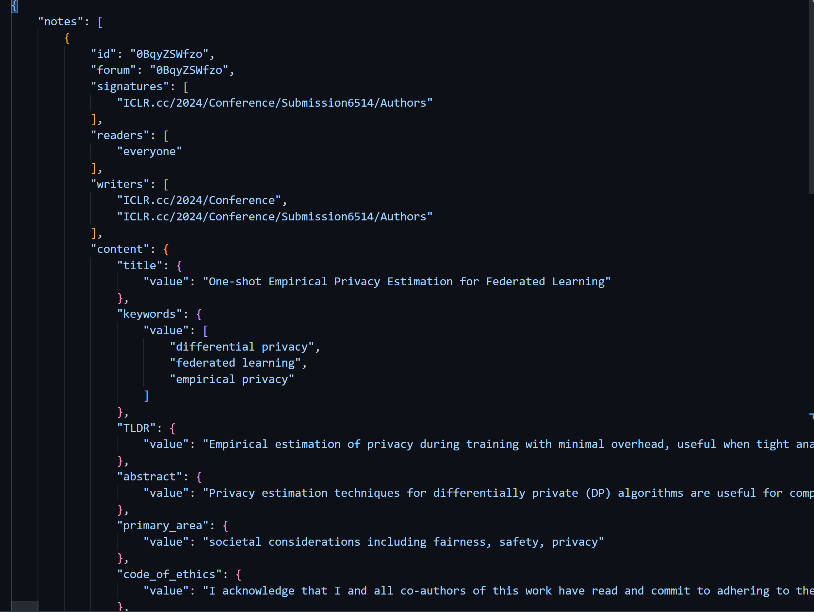
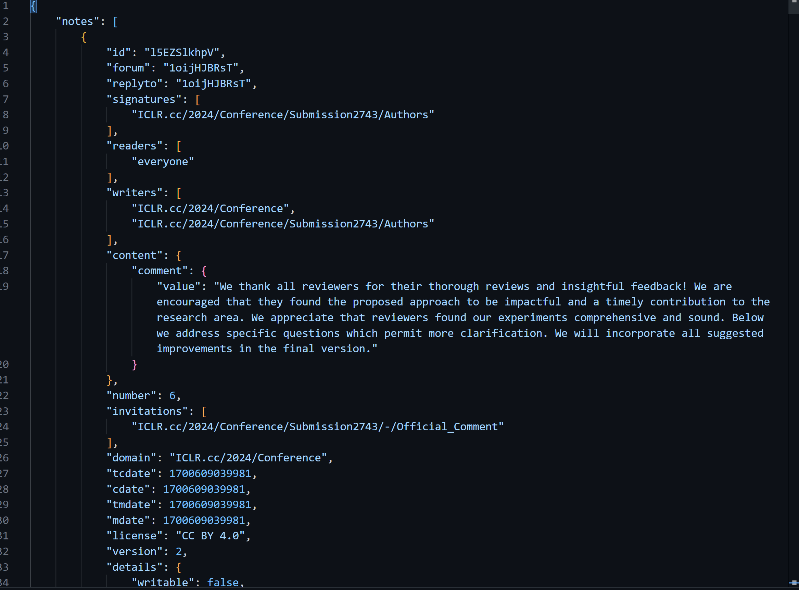
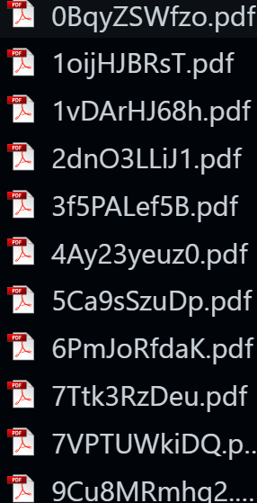

# openreview-data-scrape
An efficient and convenient way to crawl the iclr conference peer review information and pdf on the openreview website, taking ICLR2024 as an example

# example website

[url](https://openreview.net/group?id=ICLR.cc/2024/Conference#tab-accept-oral)

# files structure 
  - [get_openreview_id.py](#文件1.1) - Used to get the unique ID of each paper.
  - [get_openreview_pdf.py](#文件1.2) - Used to obtain PDF files of each paper.
  - [get_openreview_information.py](#文件1.3) - Used to obtain relevant information for each paper.
  - [get_openreview_review.py](#文件1.4) - Used to obtain review information for each paper.

# Method
  First, running get_openreview_id.py will save the id_dict.json file locally.

  Then use the json file generated above to run the remaining three py files in parallel to obtain the corresponding information locally at the same time.

# Result Demo
- Information result：

  
- Review result：

  
- Pdf result：

  
